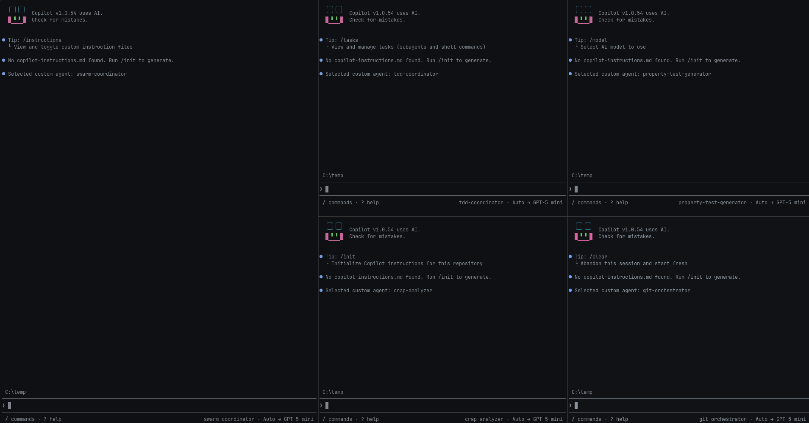

# Copilot Workflows

A reusable workflow setup for agentic development with strong quality gates, clear role separation, and practical local tooling.



## Purpose

This repository gives you a ready-to-run Copilot workflow so you do not have to rebuild prompts, roles, and setup scripts in every project.

It is built for teams or individuals who want:

- Parallel implementation with specialized agents
- Consistent quality gates and review flow
- Reproducible setup across different codebases
- A single place to evolve prompts, instructions, and process

## Configurability

The workflow is configurable on multiple levels:

- Runtime mode: VS Code task-driven swarm or WezTerm startup flow
- Language profile: config packages under `configs/` (currently `kotlin` and `python`)
- Agent/skill behavior: shared prompts in `agents/` and `skills/`
- Instruction layers: shared `copilot-instructions.md` plus language-specific profile files
- Model strategy: cost-aware defaults with optional stronger coordinator runs

## Core characteristics

- Swarm-first orchestration with explicit agent responsibilities
- Clean Architecture and DDD-oriented guidance
- Automated git hygiene via `git-orchestrator`
- Human checkpoints only where they add the most value

## Installation

```powershell
.\scripts\install.ps1
```

### What `install.ps1` does

The installer prepares your global Copilot workspace under `%USERPROFILE%\.copilot`.

It will:

- Create base folders: `skills/`, `agents/`, `context/`, and `swarm-configs/`.
- Link all shared skills from this repo into `%USERPROFILE%\.copilot\skills\*`.
- Link all shared agent prompts into `%USERPROFILE%\.copilot\agents\*`.
- Link shared root docs into `%USERPROFILE%\.copilot`:
  - `copilot-instructions.md`
  - `MEMORY.md`
  - `AGENTS.md`
  - `README.md`
- Link all supported config profiles from `configs/configs.json` into `%USERPROFILE%\.copilot\swarm-configs\<config>\`.
- Sync root `agents/` and `skills/` into `.vscode/agents/` and `.vscode/skills/` via `scripts/sync-vscode-docs.ps1`.

If symlink creation is not possible on your machine, the installer falls back to copying files/directories.

## Quick start

1. Choose your terminal mode. 
2. VS Code mode [`.vscode/README.md`](.vscode/README.md): open your project in VS Code, press `Ctrl + Shift + P` → **Tasks: Run Task**, then choose a `Swarm: ...` task.
3. WezTerm mode [`.wezterm/README.md`](.wezterm/README.md): run `./.wezterm/wezterm-start.ps1 -WorkingDirectory "<project-path>"`.


## Config package guide

- Supported config packages are defined in `configs/configs.json`.
- Use `scripts/install.ps1` to install the shared workflow and link all supported language profiles.
- A valid config package must include:
  - `global-instructions.md`
  - `MEMORY.md`
  - `README.md`
  - optional `agents/` for config-specific agent prompts
- Add new languages by creating `configs/<name>/` and adding an entry to `configs/configs.json`.

## Example workflow

1. Run installer once: `.\scripts\install.ps1`.
2. Start the swarm coordinator in VS Code.
3. Run `concept-generator` and `acceptance-test-writer`.
4. Implement the feature with `tdd-coordinator`, `property-test-generator`, and quality gates.
5. Finish with `git-orchestrator` and `documentation-updater`.

## Workflow (v0.6)

1. **Concept** → `@concept-generator`
2. **Gherkin Acceptance Tests** → `@acceptance-test-writer`
3. Human review and approval
4. **Swarm implementation** → `@swarm-coordinator`
5. Quality gates + merge

## Complete workflow (detailed)

### Phase 0: Preparation

- Create the user story or feature briefing.

### Phase 1: Concept creation

- Agent: `concept-generator`
- Refinement and challenge tools: `grill-me`, `grill-with-docs`
- Output: project-specific concept document
- Human step: review, clarify open questions, approve

### Phase 2: Acceptance tests (Gherkin)

- Agent: `acceptance-test-writer`
- Output: Gherkin feature file
- Human step: review and approve acceptance tests

### Phase 3: Implementation (Swarm mode)

The `swarm-coordinator` orchestrates parallel roles:

- Main coder: `tdd-coordinator` (`tdd-red`, `tdd-green`, `tdd-refactor`)
- Property tester: `property-test-generator`
- Quality guardian: `quality-guardian` (`crap-analyzer`, `coverage-check`, `mutation-testing`)
- Git orchestrator: `git-orchestrator`
- Architecture guard: `architectural-reviewer`
- Final reviewer: `code-review-tdd`

Typical sequence:

1. Run `tdd-red` + `property-test-generator` in parallel.
2. Continue with `tdd-green`.
3. Refactor with `tdd-refactor`.
4. Execute quality gates.
5. Prepare merge with `git-orchestrator`.

### Phase 4: Completion

- Final human review
- Merge into `main`
- Run `documentation-updater` for docs refresh

## Git workflow

- Branch names: `feature/xyz` or `story/xyz`
- Commit prefixes: `red:`, `green:`, `refactor:`, `test:`, `chore:`, `docs:`
- `git-orchestrator` keeps commit hygiene and PR prep

## Skill inventory

Shared workflow skills are maintained in `skills/`.
For the complete, current list and descriptions (including utility skills like `review`, `handoff`, `grill-me`, and `caveman`), see [`AGENTS.md`](AGENTS.md).

## Important files

| File | Purpose |
|------|---------|
| [`AGENTS.md`](AGENTS.md) | Overview of agents and skills |
| [`CONTRIBUTING.md`](CONTRIBUTING.md) | Guidelines for config packages and contributions |
| [`.vscode/README.md`](.vscode/README.md) | VS Code swarm layout and terminal guide |
| [`.vscode/tasks.json`](.vscode/tasks.json) | Quick start tasks for all agents |
| `skills/` | Shared workflow skill prompts |
| `configs/` | Language-specific config packages and metadata |
| `scripts/install.ps1` | Canonical symlink-based setup installer |

## Philosophy

Maximize quality while minimizing manual routine work by using intelligent, specialized agents with clear responsibility separation.

---

**Next steps**

- Run a real feature through the workflow.
- Add a tmux (linux) runtime mode.

---
